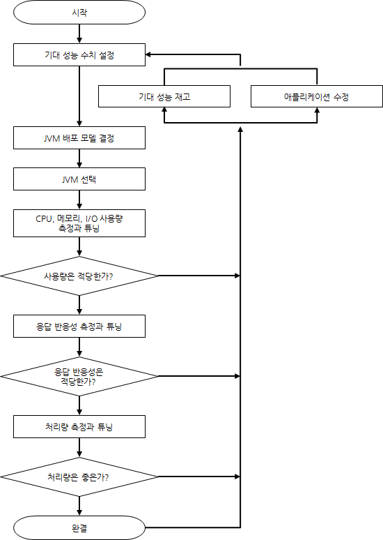
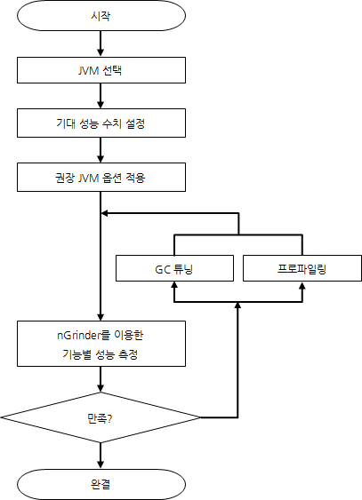

자바 애플리케이션 성능 튜닝의 도(道)

자바 애플리케이션의 성능을 튜닝하는 작업은 자바 및 JVM에 대한 지식과 수많은 튜닝 기법, 다양한 환경과 상황에 대한 경험 등을 필요로 한다. 그러나 이 모든 내용을 짧은 지면에서 소개하기에는 무리이니 이 글에서는 성능 튜닝 작업의 상세한 내용보다는 튜닝에 필요한 배경 지식과 튜닝 순서, JVM의 각종 옵션 및 튜닝 접근 방법 등의 간략한 소개를 통해 성능 튜닝의 전반적인 흐름과 방법론에 대해 살펴보도록 하자. 특히 자바 애플리케이션의 여러 도메인 중에서 인터넷 서비스를 위한 웹 애플리케이션에 중점을 두고 설명해나가겠다.

모든 애플리케이션이 튜닝을 필요로 하는 것은 아니다. 충분한 성능을 내고 있다면 굳이 추가적인 노력을 들일 필요는 없다. 하지만 방금 디버깅을 마친 애플리케이션이라고 해서 항상 목표 성능만큼 동작해 줄 것이라고 기대할 수는 없고 그렇게 기준치 이하로 성능이 미달될 때 튜닝이 필요해진다. 구현 언어에 상관없이 애플리케이션을 튜닝하는 것은 상당한 전문적인 지식과 높은 집중을 요구하는 일인데다, A라는 애플리케이션을 튜닝했을 때 사용했던 방법을 B라는 애플리케이션을 튜닝할 때 재활용할 수 있는 것도 아니다. 애플리케이션마다 고유한 동작이 있고 컴퓨터 자원을 사용하는 형태가 다르기 때문이다.

애플리케이션을 튜닝하기 위해서는 애플리케이션 작성 지식보다 좀 더 근본적이고 포괄적인, 예를 들면 버추얼머신이나 OS, 컴퓨터 아키텍처 등에 대한 지식이 필요하다. 이런 지식을 바탕으로 애플리케이션 도메인에 집중해야 수월한 튜닝이 가능하다.

자바 애플리케이션 튜닝이란 경우에 따라 GC 같은 JVM 옵션 값 변경만으로 충분할 수도 있고 아예 코드를 수정해야 할 때도 있다. 어느 방법을 선택하든 우선 자바 애플리케이션 수행 과정을 모니터링해야 한다.

그래서 이 글에서는 '어떻게 모니터링을 하는가', '어떻게 JVM 옵션을 주어야 하는가', '코드 수정 필요 판단은 어떻게 하는가'를 중심으로 살펴보도록 하겠다.

자바 애플리케이션 성능 튜닝에 필요한 지식
JVM상에서 동작하는 자바 애플리케이션의 튜닝을 위해서는 JVM의 동작 과정에 대한 이해가 필요하다. 여기서 말하는 JVM 동작 과정에 대한 지식이란 크게 Garbage Collection(이하 GC)에 대한 것과 HotSpot에 대한 지식을 꼽을 수 있다. 물론 GC나 HotSpot 지식만으로 모든 자바 애플리케이션에 대한 성능 튜닝을 할 수 있는 것은 아니지만 성능에 영향을 미치는 대부분의 요소는 이 두 가지에 속한다.

JVM의 원활한 동작 환경을 만들기 위해서는 OS가 각 프로세스에 자원을 분배하는 방식에 대한 이해가 필요하다. 자바 애플리케이션 성능 튜닝을 위해서는 JVM 자체는 물론 OS나 하드웨어에 대한 이해도 필요하다는 것이다. OS 관점에서 볼 때 JVM 또한 하나의 애플리케이션 프로세스라는 점을 염두에 두도록 하자. 덧붙여 자바 언어 도메인에 대한 지식도 중요하다. Lock이나 Concurrency에 대한 이해는 물론 클래스 로딩이나 객체 생성에 대한 지식 또한 중요도가 높다.

자바 애플리케이션 성능 튜닝을 할 때는 이러한 지식들을 종합해 접근해야 한다.

성능 튜닝 과정
<그림 1>은 찰리 헌트와 비아누 존 두 사람의 공동저서인 'Java Performance'에서 인용한 순서도로 자바 애플리케이션 성능 튜닝 과정을 표현한 것이다.

javaapplication1

그림 1 자바 애플리케이션 성능 튜닝 과정

자바 애플리케이션 성능 튜닝 과정은 한 번에 통과하는 과정이 아니라 튜닝 완결까지 몇 번이고 계속 반복할 수도 있다. 기대 성능 수치 설정 또한 마찬가지다. 튜닝 과정을 통해 기대 성능 수치를 하향해야 할 때도 있고 오히려 기대 성능 수치를 상향할 때도 있다.

JVM 배포 모델이란 하나의 JVM에서 자바 애플리케이션을 동작시킬 것인지 여러 JVM에서 자바 애플리케이션을 동작시킬 것인지 결정하는 것으로 가용성, 응답 반응성, 관리 편의성 등에 따라 변경될 수 있다.

JVM이 여러 서버에서 동작하는 경우에도 한 서버에서 여러 개의 JVM을 동작하도록 하거나 서버마다 각각의 JVM을 동작하게 할 수도 있다.

물론 하나의 서버에 몇 개의 JVM이 동작할 것인가는 서버의 코어 개수와 애플리케이션의 특성 등에 따라 결정되겠지만 응답 반응성 관점에서 양자를 비교해볼 때, 같은 애플리케이션일 경우 2GB의 힙을 사용하는 경우가 8GB 크기의 힙을 사용하는 것보다 풀 GC에 걸리는 시간이 짧아 응답 반응성에 유리하다. 하지만 8GB 힙을 사용하면 2GB보다 풀 GC 발생 간격이 그만큼 줄어들 것이고 내부 캐시를 사용하는 애플리케이션이라면 히트율을 높여 응답 반응성을 높일 수 있다.

즉 하나의 장점을 선택했을 때 그 선택에 뒤따르는 단점을 극복할 수 있는 방법을 고려해야 적합한 배포 모델을 결정할 수 있다.

JVM 선택이란 32bit JVM을 사용할 것이냐 64bit JVM을 사용할 것이냐에 대한 결정이다. 동일 조건이라면 32bit JVM을 선택하는 것이 좋다. 32bit JVM이 64bit JVM보다 수행 성능이 좋기 때문이다. 32bit JVM은 논리적 최대 사용 가능 힙 크기가 4GB로, 이보다 큰 크기의 힙을 사용할 필요가 있을 때 64bit JVM을 사용하는 것이 좋다(단 32bit OS/64bit OS 모두 실제 사용 할당 크기는 2~3GB 정도다).

표 1 성능 비교 자료(출처)

Benchmark	Time [sec]	Factor
C++         Opt	23	    1.0x
C++         Dbg	197	8.6x
Java 64-bit	    134	5.8x
Java 32-bit	    290	12.6x
Java 32-bit     GC	106	4.6x
Java 32-bit     SPEC GC	89	3.7x
Scala   	82      	3.6x
Scala low-level	    67	2.9x
Scala low-level GC	58	2.5x
Go 6g	            161	7.0x
Go Pro	            126	5.5x
이제 작성한 애플리케이션을 가동해 성능을 측정하자. 이 과정에서 시스템 모니터링 도구나 프로파일링 도구를 사용해 GC 튜닝, OS 설정 변경, 코드 수정 등의 작업을 한다.

응답 반응성을 위한 튜닝과 처리량을 위한 튜닝은 별개의 작업일 수 있다. 단위 시간당 처리량이 많더라도 풀 GC 등을 위해 때때로 긴 'stop the world' 현상이 발생한다면 응답 반응성이 낮아지게 된다. 또한 일정 부분 트레이드 오프가 발생할 수 있음을 고려해야 한다. 이런 트레이드 오프는 응답 반응성과 처리량 사이의 관계에만 있지는 않음을 염두에 두자. 적은 메모리 사용을 위해 CPU 자원을 더 사용해야 하거나 응답 반응성이나 처리량 손실을 감수해야 할 수도 있고 반대의 경우도 발생한다. 그러므로 우선순위를 설정해 접근해야 한다.

<그림 1>의 순서도는 Swing 애플리케이션을 포함한 포괄적인 자바 애플리케이션에 대한 성능 튜닝 접근 방법이기에 인터넷 서비스를 위한 서버 애플리케이션을 작성할 때는 적합하지 않다. <그림 1>을 바탕으로 인터넷 서비스에 맞는 절차를 만들면 <그림 2>와 같은 순서도가 된다.

javaapplication2

그림 2 인터넷 서비스 자바 애플리케이션 권장 튜닝 절차

<그림 2>를 참고해 각각의 절차를 수행하기 위해 필요한 일을 알아보도록 하자.

JVM 옵션
웹 애플리케이션 서버 위주로 JVM 옵션 지정 방법을 설명하겠다. 모든 경우라고 할 수는 없지만 대부분의 웹 서버 애플리케이션에서 가장 좋은 GC 알고리즘은 Concurrent Mark Sweep GC다. 이는 낮은 딜레이가 중요하기 때문인데, 물론 Concurrent Mark Sweep을 사용할 경우에는 fraction이 발생해 경우에 따라 매우 긴 Stop the World 현상이 발생할 수도 있다. 하지만 이 역시 New 영역의 크기나 fraction ratio를 조정해 해결할 수 있는 경우가 많다.

전체 힙 사이즈의 크기 지정만큼 New 영역의 크기 지정 또한 중요하다. XX:NewRatio 옵션을 이용해 전체 힙 크기 중 New 크기의 비율을 지정하거나 XX:NewSize 옵션을 사용해 원하는 크기만큼의 New 영역 크기를 지정하는 것이 좋다. 대부분의 객체는 생존 시간이 길지 않기 때문에 New 영역 크기 지정이 중요해진다. 웹 애플리케이션에서 캐시 데이터를 제외한 대부분의 객체는 HttpRequest에 대한 HttpResponse가 만들어지는 시간에 생성된다. 보통 이 시간은 1초를 넘지 않기에 객체의 생존 시간도 1초가 되지 않는다. 만약 New 영역의 크기가 크지 않다면 새로 생성되는 객체의 자리를 위해 Old 영역으로 이동돼야 하고 Old 영역에 대한 GC 비용은 New 영역에 대한 GC 비용보다 상당히 크기 때문에 충분한 New 영역 크기를 잡아줘야 한다.

다만 일정 수치 이상으로 New 영역의 크기가 커지면 오히려 응답 반응성이 떨어지는 문제가 발생할 수 있으므로 주의하자. New 영역에 대한 GC는 기본적으로 어느 한 서바이버 영역에서 다른 서바이버 영역으로 복사하는 것이기 때문이다. 또한 Old 영역뿐만 아니라 New 영역에 대한 GC를 할 때에도 Stop the World 현상은 발생한다. New 영역이 커지면 상대적으로 서바이버 영역의 크기도 커져 그만큼 복사해야 할 데이터의 크기도 늘어난다. 이런 특성을 감안해 New 영역의 크기를 정할 때는 HotSpot JVM의 OS별 NewRatio를 참고하는 것이 좋다.

표 2 OS와 옵션별 NewRatio

OS & option	디폴트 –XX:NewRatio
Sparc –server	2
Sparc –client	8
x86 –server	8
x86 –client	12
NewRatio를 지정하면 전체 힙 크기 중에서 1/(NewRatio + 1) 만큼이 New 영역의 크기가 된다. Sparc server의 NewRatio가 유독 작은 것을 알 수 있는데 기본값을 정하던 당시 x86보다 Sparc 시스템을 하이엔드 용도로 사용했기 때문이다. 요즘은 x86 서버 사용이 흔해졌고 성능 또한 향상됐기 때문에 Sparc server에 준하는 값인 2 또는 3 정도를 지정하는 것이 좋다.

NewRatio 대신 NewSize와 MaxNewSize를 지정할 수도 있다. NewSize에서 지정한 값만큼 New 영역이 생성됐다가 MaxNewSize에서 지정한 만큼 New 영역이 커진다. Eden이나 서바이버 또한 지정된 또는 기본 비율에 따라 같이 커진다. Xs와 Xmx 크기를 같게 하는 것처럼 NewSize와 MaxNewSize 또한 같게 지정하는 것이 좋다.

NewRatio와 NewSize를 지정했을 때는 둘 중 큰 값을 사용하기 때문에 힙이 생성됐을 때 최초의 New 영역의 크기는 다음과 같다.

min(MaxNewSize, max(NewSize, heap/(NewRatio+1)))

전체 힙과 New 영역의 적합한 크기를 한 번에 알 수는 없다. 웹 서버 애플리케이션을 기준으로 <표 3>과 같은 JVM 옵션으로 자바 애플리케이션을 가동해보는 것을 권한다. 이 옵션들로 성능을 모니터링한 후 더 적합한 GC 알고리즘이나 옵션으로 변경하자.

표 3 모니터링 후 옵션변경 예시

종류	            옵션
동작 모드	-sever
전체 힙 크기	-Xms와 –Xmx의 값을 같게
New 영역 크기	-XX:NewRatio 2~4 정도의 값
-XX:NewSize=?
–XX:MaxNewSize=?
NewRatio 대신 NewSize를 지정하는 것도 좋다.
Perm 크기	-XX:PermSize=256m
-XX:MaxPermSize=256m
성능에 영향을 미치지 않으므로 동작에 문제가 없을 정도만 지정한다.
GC 로그	-Xloggc:$CATALINA_BASE/logs/gc.log
-XX:+PrintGCDetails
-XX:+PrintGCDateStamps
GC로그를 남기는 것은 특별히 Java 애플리케이션 수행 성능에 영향을 미치지 않는다. 가급적이면 GC 로그를 남기는 것이 좋다.
GC 알고리즘	-XX:+UseParNewGC
-XX:+CMSParallelRemarkEnabled
-XX:+UseConcMarkSweepGC
-XX:CMSInitiatingOccupancyFraction=75
일반적으로 권할만한 설정일 뿐이다. 애플리케이션 특성에 따라 다른 선택이 더 좋을 수 있다.
OOM 에러 발생 시 힙 덤프 생성	-XX:+HeapDumpOnOutOfMemoryError
-XX:HeapDumpPath=$CATALINA_BASE/logs
OOM 발생 이후 조치	-XX:OnOutOfMemoryError=$CATALINA_HOME/bin/stop.sh 또는
-XX:OnOutOfMemoryError=$CATALINA_HOME/bin/restart.sh 힙 덤프를 남긴 뒤, 관리 정책에 맞게 적합한 동작을 취할 수 있도록 한다.
애플리케이션 성능 측정
애플리케이션 성능을 측정하기 위해 파악해야 할 정보는 다음과 같다.

TPS(Transaction Per Second)/OPS(Operation Per Second): 개념적으로 해당 애플리케이션의 성능을 이해하는데 필요한 정보다.
RPS(Request Per Second): 엄밀한 의미에서 응답 반응성과는 다르지만 RPS를 응답 반응성으로 이해해도 큰 무리는 없다. 사용자가 원하는 결과를 보기 위해 기다려야 하는 시간을 알 수 있다.
RPS 표준편차: 가급적 고른 RPS가 나오도록 할 필요가 있다. 편차가 발생한다면 GC 튜닝이나 연동 시스템에 대한 점검이 필요하다.
정확한 성능 수치를 위해 충분히 워밍업된 상태에서 측정하는 것이 필요하다. HotSpot JIT에 의해 바이트 코드가 컴파일된 상태가 되기를 기대하기 때문인데, nGrider를 이용해 통상 10분 이상 특정 기능에 대한 부하를 준 뒤 성능 수치를 측정하는 것이 좋다.

본격적인 튜닝
본격적으로 사례별 접근 방법을 알아보자.

Stop the World 시간이 길다
Stop the World 시간이 긴 이유는 적합하지 않은 GC 옵션 때문일 수도 있지만 잘못된 구현 때문일 수도 있다. 프로파일러나 힙 덤프 결과를 통해 힙을 차지하고 있는 객체의 종류와 생성 개수를 확인해보고 적합여부를 판단한다. 불필요한 객체가 많이 생성돼 있다면 코드를 수정하는 것이 좋다.

객체 생성 과정에 특별한 문제가 없다면 GC 옵션을 변경하자. 적합한 GC 옵션 조정을 위해서는 충분한 시간 동안 확보한 GC 로그가 필요하다. 어떤 상황에서 긴 Stop the World가 일어나는지 파악하자.

GC는 객체를 얼마나 많이 생성하느냐보다는 생성된 객체가 얼마나 오래 남아있는가가 더 중요하다. 즉 객체가 보다 빨리 GC 대상이 될수록 Stop the World 시간은 줄어들 가능성이 높다.

객체가 빨리 GC 되게 만드는 팁은 다음과 같다.

객체의 크기를 가급적 작게 유지한다.
Collection이나 기타 Container 형태의 자료구조 안에서 배열의 크기를 변경하는 작업은 가급적 피하자.
SoftReference는 사용하지 않는 게 좋다.
CPU 사용률이 낮다
TPS가 낮은데 CPU 사용률도 낮다면 blocking time이 원인이다. 이 경우 연동 시스템의 문제나 동시성(concurrency) 문제일 수 있다. 스레드 덤프 결과 분석이나 프로파일러를 이용해 확인할 수 있다. 상용 프로파일러를 이용하면 매우 정밀한 lock 분석을 할 수 있지만 대부분의 경우 jvisualvm에 있는 CPU 분석만으로도 충분한 결과를 얻을 수 있다.

CPU 사용률이 높다
TPS가 낮은데 CPU 사용률만 높다면 효율적이지 못한 구현 때문일 가능성이 높다. 이 경우 프로파일러를 이용한 병목 지점 파악이 유효하다. jvisualvm이나 eclipse의 TPTP, JProbe 등을 이용해 분석하자.

튜닝 접근 방법
애플리케이션을 튜닝할 때는 먼저 성능 튜닝이 필요한지 파악해야 한다. 성능 측정 과정은 매우 고되고 언제나 좋은 결과를 얻을 수 있다는 보장도 없기 때문에 충분한 목표 성능을 만족하고 있다면 굳이 튜닝을 하지 않는 것이 효율적이다.

문제는 단 한 곳에 있고 그 하나만 수정하면 된다: 파레토 이론은 성능 튜닝에도 적용된다. 문제는 반드시 하나라는 의미보다는 가장 성능에 영향을 미치는 하나에만 집중해 접근할 필요가 있다는 뜻으로 해석하자. 하나에 집중해서 해결하고 난 다음에 다른 문제 해결을 위해 노력하도록 하자.
풍선 효과: 무엇을 얻기 위해 무엇을 포기해야 하는지 결정해야 한다. 캐시를 적용해 응답 반응성을 높일 수는 있지만 캐시의 크기가 커지면 풀 GC 시간이 길어질 수 있다. 적은 메모리 사용량을 선택하면 대개 처리 용량이나 응답 반응 시간이 나빠진다. 하나를 선택하면 하나를 포기해야 한다는 것을 염두에 두고 우선순위를 정해 선택하자.
여기까지 자바 애플리케이션 성능 튜닝 방법을 정리해 봤다. 성능 측정에 대한 구체적인 절차를 만들다보니 세부적인 정보를 제외하고 설명하기도 했지만 자바 웹 서버 애플리케이션을 튜닝하기 위한 대부분의 경우는 만족시킬 수 있을 것이라 생각한다.

참고: 성능 튜닝 도구
성능 튜닝 작업을 위해서는 Java 애플리케이션의 성능을 측정하고 실행 상태를 모니터링할 다양한 도구가 필요하다. JDK에 내장된 명령 도구인 jstat, jmap, jstack, jhat도 유용하지만 그 외에도 다양한 도구가 있어 소개한다.

프로파일링 도구
JProbe, Yourkit 등의 상용 제품이 유명한데 대부분의 프로파일링 도구는 상용제품으로, 오픈소스나 공개된 프로파일링 도구는 거의 없는 형편이다.

Eclipse TPTP: 현재는 개발이 중단된 상태이나 공개된 프로파일링 도구 중 꽤 쓸만한 편이다.
JVisualVM: JDK에 포함된 기본 도구로 GC 분석, 힙 덤프 및 스레드 덤프 생성, 스레드 모니터링 등의 다양한 용도로 사용할 수 있다. 내장된 샘플러 도구를 통해 간단한 프로파일링이 가능하다.
성능 측정용 도구
성능 측정용 도구로는 HP의 LoadRunner가 가장 유명하다. 그러나 상용제품으로 꽤 비싼 가격이므로 본문에서 언급한 nGrinder를 소개한다.

nGrinder: NHN에서 제작해 공개한 오픈소스로 기존 오픈소스 성능 측정 도구인 Grinder의 불편한 점을 보완하고 통합 환경을 제공한다.
GC 로그 분석 도구
본문의 <표 3>처럼 GC 로그를 남겼다면 다양한 GUI 도구를 이용해 GC 추이를 분석할 수 있다.

Hpjmeter: HP에서 개발 배포하는 자바 성능 분석 도구로 Heap Dump 분석, 모니터링 등의 여러 기능을 가지고 있는 멀티툴이지만 GC 로그를 매우 깔끔하게 보여주므로 GC 로그 분석기로도 사용하기 좋다.
GC Viewer: 오픈소스로 개발된 GC 로그 뷰어다.
IBM Pattern Modeling and Analysis Tool for Java Garbage Collector: IBM developerworks에서 개발해 공개한 GC 로그 뷰어다.
JVisualVM의 VisualGC plugin: JVisualVM 내에 탑재된 GC 모니터링 플러그인이다. 현재의 GC 동작을 모니터링하기에 유용하다.
힙 덤프 분석 도구
Stop the World 시간이 길거나 기타 이유로 성능이 나쁘다고 여겨질 때 힙 덤프를 얻어 분석하는 것도 효과적이다.

Eclipse Memory Analyzer: 흔히 이클립스 MAT이라고 부르는 이클립스 기반의 메모리 분석기다. 이클립스 플러그인으로 설치해 사용할 수도 있고 이클립스 RCP로 된 스탠드 얼론 프로그램으로 사용할 수도 있다.
IBM HeapAnalyzer: IBM developerworks에서 개발해 공개하고 있는 힙 메모리 분석기다.